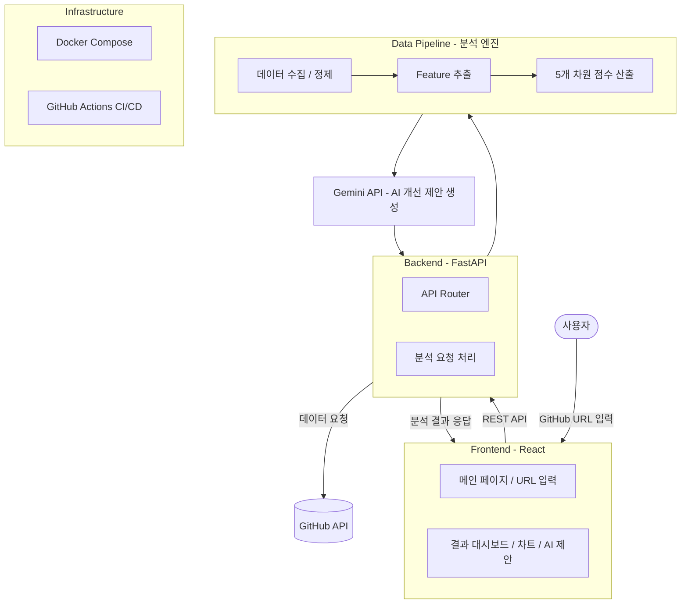

# OSS Health Checker

> GitHub 레포지토리의 오픈소스 건강도를 분석하고 개선점을 제안하는 웹 서비스

## 프로젝트 소개

오픈소스 프로젝트를 사용하거나 기여하려 할 때, 해당 프로젝트가 **얼마나 잘 관리되고 있는지** 판단하기 어렵습니다. 커밋 기록, 이슈 응답 속도, 기여자 구조, 라이선스 유무 등을 하나하나 직접 확인해야 하고, 어떤 기준으로 평가해야 하는지도 명확하지 않습니다.

**OSS Health Checker**는 GitHub 레포지토리 URL을 입력하면, GitHub API 데이터를 기반으로 **5가지 평가 차원**에서 건강도를 자동 분석하고, **AI 기반 개선 제안**까지 제공하는 웹 서비스입니다.

### 5가지 평가 차원

| 차원 | 핵심 질문 |
|------|-----------|
| **커뮤니티 활성도** | 이 프로젝트는 현재 살아 움직이고 있는가? |
| **지속 가능성** | 이 프로젝트는 앞으로도 유지될 수 있는가? |
| **코드 품질 및 신뢰성** | 이 프로젝트의 산출물은 믿을 수 있는가? |
| **법적/운영 거버넌스** | 이 프로젝트는 조직적으로 안전하게 운영되는가? |
| **프로젝트 성숙도** | 이 프로젝트는 성숙한 운영 체계를 갖추었는가? |

## 시스템 아키텍처

### 데이터 흐름

1. 사용자가 GitHub 레포지토리 URL을 입력
2. FastAPI 백엔드가 요청을 수신
3. GitHub API로 레포 데이터 수집 (커밋, 이슈, PR, 릴리즈, 기여자, 라이선스 등)
4. Data Pipeline에서 데이터 정제 및 Feature 추출
5. 5개 차원별 점수 산출 (커뮤니티 활성도 / 지속 가능성 / 코드 품질 / 거버넌스 / 성숙도)
6. Gemini API로 분석 결과 기반 개선 제안 생성
7. 프론트엔드 대시보드에 점수, 차트, AI 제안 표시

## 레포지토리 구조

| 레포지토리 | 설명 | 담당 |
|-----------|------|------|
| [oss-health-frontend](https://github.com/OpenSource-2026/oss-health-frontend) | React 기반 사용자 UI — 메인 페이지, 결과 대시보드 | 강수빈, 한예준 |
| [oss-health-backend](https://github.com/OpenSource-2026/oss-health-backend) | FastAPI 백엔드 — API 서버, Docker, CI/CD | 신바다 |
| [oss-health-data-pipeline](https://github.com/OpenSource-2026/oss-health-data-pipeline) | 건강도 분석 엔진 — GitHub 데이터 수집, Feature 선별, 점수화 | 김나경 |

## 기술 스택

| 영역 | 기술 |
|------|------|
| Frontend | React, Tailwind CSS, Chart.js |
| Backend | Python, FastAPI |
| Data Pipeline | Python, GitHub REST API |
| AI Report | Gemini API |
| Infra | Docker, Docker Compose |
| CI/CD | GitHub Actions |
| Version Control | Git, GitHub |

## 팀원

| 이름 | 역할 |
|------|------|
| 김나경 (팀장) | Data Pipeline — 건강도 지표 설계, GitHub 데이터 수집 및 분석 엔진 개발 |
| 신바다 | Backend + DevOps — FastAPI 서버, Docker, CI/CD, 시스템 통합 |
| 강수빈 | Frontend — 메인 페이지, URL 입력, 프로젝트 소개 화면 |
| 한예준 | Frontend — 결과 대시보드, 차트 시각화, AI 제안 표시 화면 |

## 라이선스

이 프로젝트는 [Apache License 2.0](LICENSE)을 따릅니다.
